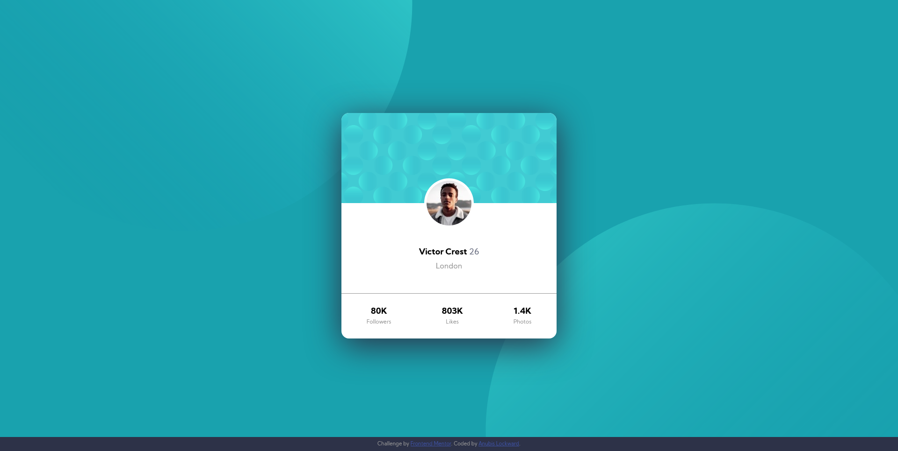

# Frontend Mentor - Profile card component solution

This is a solution to the [Profile card component challenge on Frontend Mentor](https://www.frontendmentor.io/challenges/profile-card-component-cfArpWshJ). Frontend Mentor challenges help you improve your coding skills by building realistic projects. 

## Table of contents

- [Overview](#overview)
  - [The challenge](#the-challenge)
  - [Screenshot](#screenshot)
  - [Links](#links)
- [My process](#my-process)
  - [Built with](#built-with)
  - [What I learned](#what-i-learned)
  - [Continued development](#continued-development)
  - [Useful resources](#useful-resources)
- [Author](#author)

## Overview

### The challenge

- Build out the project to the designs provided

### Screenshot



### Links

- Solution URL: [GitHub for Profile Card Component](https://github.com/mr2much/webdev/tree/master/practice/profile-card-component-main)
- Live Site URL: [Profile Card Component](https://github.com/mr2much/webdev/tree/master/practice/profile-card-component-main)

## My process

### Built with

- ~~Semantic HTML5 markup~~ Will update project later to include Semantic markup
- CSS custom properties
- Flexbox
- Mobile-first workflow

### What I learned

For the first time ever, I managed to use the ``background`` property to set various stuff at the same time, like the images at the top and bottom as well as the background color. I had to read some documentation on MDN since I didn't want to google around code snippets on Stack Overflow. Positioning the images took me a few minutes and was not as straight forward as just setting ``left top`` or ``right bottom``.

Here's how I did it:

```css
background: left -90% top 60% / 75% no-repeat url("../images/bg-pattern-top.svg"),
    right -90% top -40% / 75% no-repeat url("../images/bg-pattern-bottom.svg"),
    hsl(185, 75%, 39%);
```

In the end, I had to make some adjustments to the background positioning, since it was not working on different media sizes. I also set a couple extra media queries for different viewports that were not specified in the design document, basically only aiming the width of the central card container. I also adjusted the CSS a bit to be Mobile first, then adjusted for wider viewports with these media queries.

Positioning the image to look like the one in the example was a lot trickier than I thought, and despite my best efforts, I had to do some googling to see how it was done. At first I was trying to do some ``position: relative`` to set it relative to its parent container, as if trying to position the image between two divs, but then I realized that there was no other div in the first place. In the end, what I found didn't work because of the layout on the HTML, so I added another div, set the image as its background, and then another div with the information. Then it was only a matter of making the div with the image round, adding a bit of negative marging on the top with half of the image's height, and then setting the image to occupy 100% of the space inside of the div. 

Here is the HTML:

```html
<!-- This is inside of a parent .card container -->
      <div class="heading"></div>
      <div class="main">
        <div class="img"></div>
        <div class="info">
          <p><span class="name">Victor Crest</span> 26</p>
          <p>London</p>
        </div>
      </div>
<!-- This is inside of a parent .card container -->
```

And here is the CSS:

```css
.card .img {
  border: 0.35em solid #fff;
  background: center / cover url("../images/image-victor.jpg");
  position: relative;
  top: -53px;
  border-radius: 100%;
  overflow: hidden;
  margin: 0 auto;
  width: 106px;
  height: 106px;
}
```

Yet there was something off about the way I did this. The DIV containing the image was kind of messing up the layout, and thus, it was causing problems with the positioning of the text below it. But then, I remembered that I had some other practice project I did a while back when learning about the ``position`` property from a Web Dev course that I am taking. I did this project to help me understand what was going on, so I remembered that if you place an absolute positioned element inside of another element that's positioned relative, then the first element will be "absolutely positioned, relative to its parent", yet when I did this, my alreadly centered image went bonkers, and I had to change the CSS a bit to manage to center the image once again. For this, I once again had to check some code on Stack Overflow. I included the link to the answer down at Useful Resources. A note about this, if you don't set the ``left: 0; right 0;`` then ``margin: 0 auto;`` won't work.

Here's the new CSS:

```css
.card .img {
  border: 0.35em solid #fff;
  background: center / cover url("../images/image-victor.jpg");
  position: absolute;
  top: -53px;
  left: 0;
  right: 0;
  margin: 0 auto;
  border-radius: 100%;
  overflow: hidden;
  width: 106px;
  height: 106px;
}
```

Finally, I had some struggle to position the footer at the bottom of the page, I couldn't figure out how to do it since I had set up the ``body`` element to be a Flex container with its elements centered, and when reading on MDN I found out that ``justify-self`` property is ignored when the display of an element is set to Flex. So, I decided to set the position to absolute on the footer element, with a bottom value of 0. Added some background color, a bit of padding and made it 100% width to make it stand out a bit, and voila. I'm quite happy with the result.

### Continued development

I think I would like to create a similar layout to this one in the future, positioning the images on the corners was specially tricky, and I'm not quite happy with the end result, even if it looks pretty similar to the image provided for the design. I would also like to practice a bit more with positioning the round image between the two divs, this is something that I have seen done quite often and it was quite fun doing it, but I don't feel too good having to have Googled how to do it correctly in the first place.

### Useful resources

- [Positioning Offset Background Images](https://css-tricks.com/positioning-offset-background-images/) - Amazing article explaining how to position images with an offset.
- [Center an element with "absolute" position and undefined with in CSS](https://stackoverflow.com/questions/1776915/center-an-element-with-absolute-position-and-undefined-width-in-css) - I was having some issues with positioning the DIV containing the image horizontally, this answer helped me.

## Author

- Website - [My Portfolio, please not that it is still a work in progress](https://mr2much.github.io/webdev/)
- Frontend Mentor - [@mr2much](https://www.frontendmentor.io/profile/mr2much)
- Twitter - [@Cold_Dog](https://twitter.com/Cold_Dog)
